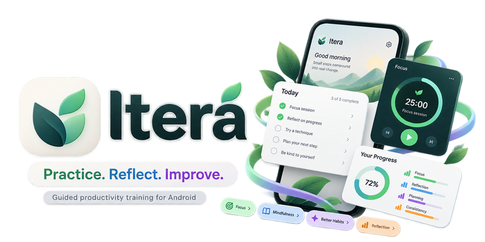
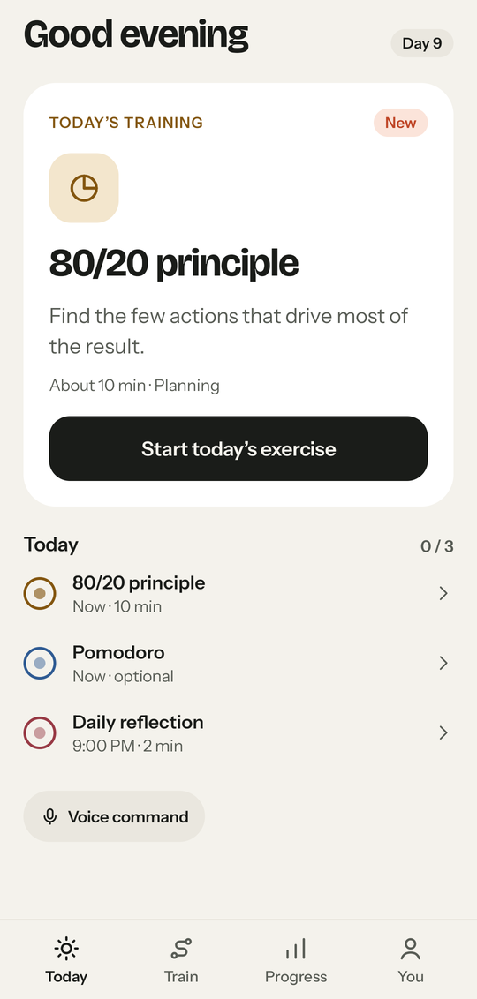
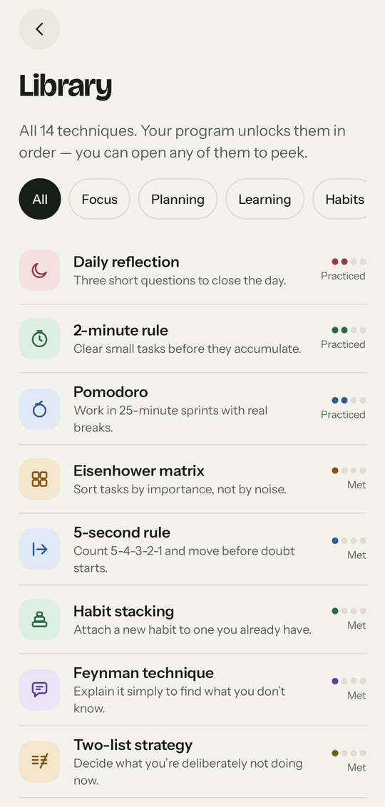
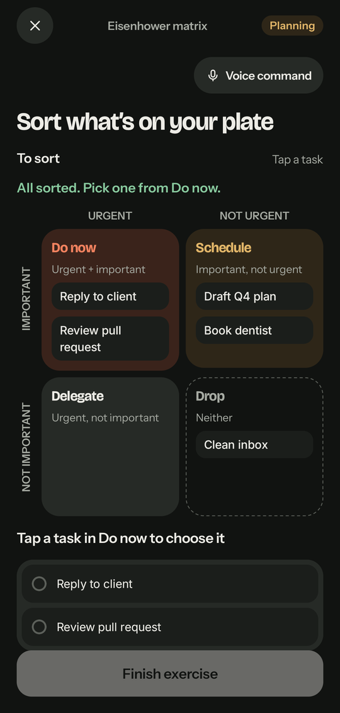
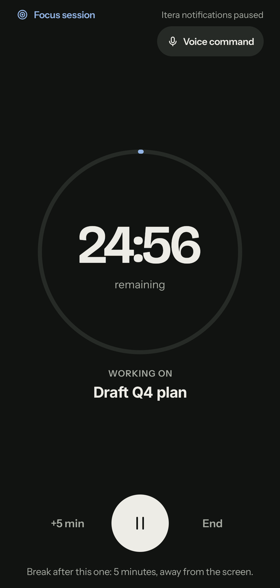
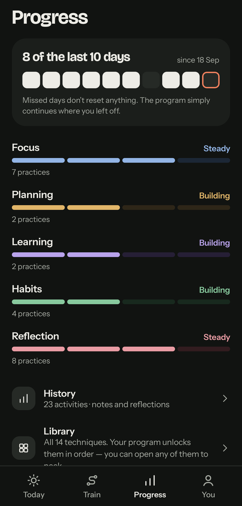
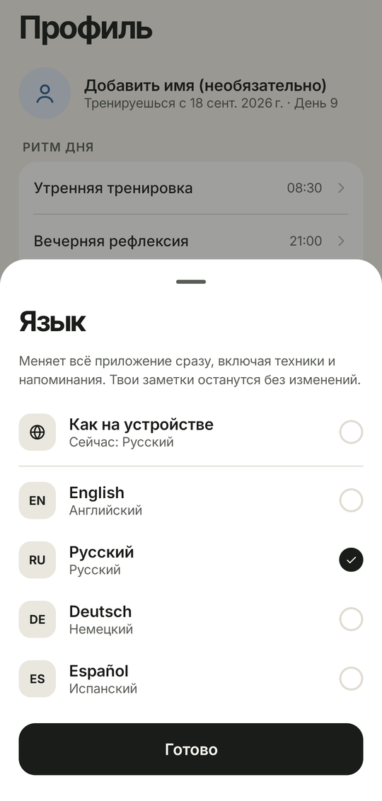

<p align="center">
  
</p>

# Itera

A native Android app that teaches productivity techniques through daily practice, not through another list of things to do.

> **Status: in development, not yet released.**
> Onboarding, the daily flow, every exercise, Train, the technique library, Progress, History, Settings and voice input are implemented. Reminders and notifications, the full accessibility and localisation passes, test hardening and release readiness are still in progress. The issue index has [milestone status and open acceptance checks](docs/issues/README.md#current-status-2026-09-27).

## What it is

Most productivity apps store your tasks. Itera teaches you how to work: one technique at a time, one small exercise a day, done in real life rather than in the app.

<p align="center">
  
</p>

## How it works

Each day has three touchpoints:

- **Morning:** one exercise from one technique. A short "why", then a concrete action to take in real life. Afterwards you rate how it went (easy, okay or hard) and can add a note.
- **During the day (optional):** a focus block with a Pomodoro or Deep Work timer.
- **Evening:** a two-minute reflection on what went well, what didn't, and what changes tomorrow.

Daily reflection is available from Day 1. The other thirteen techniques unlock one per program day, on Days 1-13. Day 14 is the first combination day, where several techniques are chained together. From Day 15, every third day is a generated combination and the others are practice days. Spaced reviews bring earlier material back.

Program days advance when you train, not by the calendar. Missing a day never resets anything and never shows a warning.

## The fourteen techniques

| Skill | Techniques |
| --- | --- |
| Focus | 5-second rule, Pomodoro, Deep Work, Information diet |
| Planning | Eisenhower matrix, 80/20 principle, Two-list strategy |
| Learning | Feynman technique, Spaced repetition |
| Habits | 2-minute rule, Habit stacking, 1% improvement |
| Reflection | Daily reflection, Premortem |

All fourteen are visible in the library from the start. Locked ones can be opened and read before they unlock. The unlock order is in [`docs/engine/04-unlock-rules.md`](docs/engine/04-unlock-rules.md).

## Key features

- **Dedicated exercises:** Eisenhower matrix, Feynman technique, habit stacking, premortem, the focus timer and combination days. Simpler techniques use a shared exercise runner.
- **Progress without pressure:** five skill rows, a 14-day regularity strip, a history calendar, and a weekly look-back in the evening reflection.
- **Four languages:** English, Russian, German and Spanish, covering the whole app including technique content. You can switch from Welcome or Settings at any time, and the choice survives restarts. It uses Android's per-app language setting, so the phone's system language is left alone. Switching recreates the screen in the new language; no app restart is needed.
- **Push-to-talk voice input:**
  - dictation into text fields
  - a small, fixed set of commands in all four languages, such as adding or completing an item, starting, pausing or ending a focus session, and completing the current exercise
  - commands come from explicit phrase tables, not AI, and actions that are hard to undo ask for confirmation first
  - recognition prefers the phone's **on-device** recognizer (Android 12+). Without one, Itera can use the system's selected speech service, or a speech recognition app you pick from the installed ones, but only after a consent screen that says it may process audio remotely. Itera never picks a provider for you and never switches silently; both choices can be changed or turned off in Settings. Without any usable recognizer, the microphone reports voice as unavailable.
  - keyboard and touch always work.
- **Journal export:** your practice journal can be exported as Markdown through the Android share sheet.

## Screenshots

Taken from the production app (`app/`) on a 1080×2400 emulator using the built-in demo data (Day 9). Status and navigation bars are cropped out.

<table>
  <tr>
    <td align="center" width="33%"><br><sub>Technique library</sub></td>
    <td align="center" width="33%"><br><sub>Eisenhower matrix (dark)</sub></td>
    <td align="center" width="33%"><br><sub>Focus timer</sub></td>
  </tr>
  <tr>
    <td align="center"><br><sub>Progress (dark)</sub></td>
    <td align="center"><br><sub>Language switch (Russian)</sub></td>
    <td></td>
  </tr>
</table>

## What it deliberately is not

- **Not a task manager.** The database has no task entity outside an exercise.
- **Not gamified.** No streak, no XP, no points, no leaderboard, no percentage complete.
- **Not online.** No account, no backend, no sync, no subscription, no AI requirement.
- **Not a coach that makes things up.** No generated feedback is ever shown. The AI coach panel ships in a "Coming later" state.
- **Not a dashboard.** Home answers one question, "what should I do right now?", with one main action and a short list.

Rest days are shown honestly, never hidden or scolded.

## Privacy

- **No account and no backend.** There is no sign-in, server or cloud sync.
- **No `INTERNET` permission.** The manifest does not declare it. The permissions it does declare cover notifications, rescheduling reminders after a reboot, the focus-timer foreground service, and the microphone for voice.
- **Your data stays on the device.** Room and DataStore files are excluded from Android cloud backup. They are included only in direct device-to-device transfer. Journal export happens only when you ask for it.
- **Voice is on-device when the phone allows it.** Otherwise a system or installed speech service is used only after you agree to it by name, and it may process audio remotely; on Android 13+ Itera may capture the microphone itself and hand the audio to that service, in memory only. Itera itself has no network access. Listening starts only when you tap the microphone, and it stops after one utterance. There is no continuous listening, no hotword and no background microphone use.
- **Nothing you write or say is logged.** Audio is never stored, and transcripts are never logged or sent to analytics. Final dictated text is saved exactly like typed text. The local analytics log records only fixed event names and enumerated values, never text you wrote.

The full voice decision is [ADR-0022](docs/architecture/adr/0022-voice-recognition-and-privacy.md).

## Tech stack

Production app (`app/`):

- Kotlin, Coroutines and Flow
- Jetpack Compose with Material 3, Navigation Compose, Lifecycle/ViewModel (MVVM, one immutable `UiState` per screen)
- Hilt for dependency injection
- Room for persistence and DataStore for preferences
- WorkManager for reminders and background upkeep, plus a foreground service for the focus timer
- AppCompat per-app locales (`AppCompatDelegate.setApplicationLocales`)
- Android `SpeechRecognizer` for voice: on-device first, then a consented system or user-chosen recognition service
- kotlinx.serialization and kotlinx.collections.immutable
- Testing: JUnit, Robolectric, Compose UI tests, Turbine, Roborazzi and Kover
- Build tooling: KSP, Spotless and custom Compose lint checks

Single Gradle module with enforced package boundaries. minSdk 26 (Android 8.0), target/compileSdk 37. Four bundled typefaces; a script-based selection rule covers Cyrillic ([ADR-0019](docs/architecture/adr/0019-typography-and-script-coverage.md)). Full list and pinned versions: [`docs/architecture/06-dependency-catalog.md`](docs/architecture/06-dependency-catalog.md) and `gradle/libs.versions.toml`.

## Repository layout

| Path | What it is |
| --- | --- |
| [`design/`](design/) | **A runnable Compose prototype of the whole app**: screens, theme, components, icons, navigation and four languages, with in-memory state. It is the UI/UX reference, not a dependency. |
| `app/` | **The production application** (`com.wivernz.itera`). |
| [`docs/`](docs/README.md) | The specification: product documents, UX, architecture, engines, testing, ADRs and milestone issues. |
| [`scripts/`](scripts/README.md) | Windows scripts for versioning and signed releases. |
| [`licenses/`](licenses/fonts/README.md) | Font licences and pinned source hashes. |
| [`docs/images/`](docs/images/) | README screenshots of the production app. |

## Getting started

### Requirements

- Android Studio Ladybug (2024.2) or newer
- JDK 25 for the production app (the committed daemon JVM criteria select it; it can be provisioned automatically); JDK 17+ for the prototype
- Android SDK with platform `android-37.0` and build tools `36.0.0`. Point to it with `ANDROID_HOME` or with `sdk.dir` in the ignored `local.properties`.
- A device or emulator on Android 8.0 (API 26) or newer. Voice needs an on-device recognizer (Android 12+), a usable system recognizer, or an installed recognition app that accepts requests from other apps.

The first build needs network access for Gradle and dependencies. The app itself never does.

### Run the prototype

```bash
cd design
./gradlew installDebug
```

Or open `design/` as its own Android Studio project. On the Welcome screen, **"Explore with demo data"** jumps to Day 9 with realistic history, and the language pill switches languages at runtime. The prototype's own notes are in [`design/README.md`](design/README.md) (in Russian).

### Build and run the production app

```bash
./gradlew installDebug
adb shell am start -W -n com.wivernz.itera/.MainActivity
```

Debug builds also offer "Explore with demo data" on Welcome. On Windows, use `.\gradlew.bat` instead of `./gradlew`.

The two projects are separate Gradle builds with different application ids and toolchains, so both can be installed at once for side-by-side comparison.

### Build and test

```bash
./gradlew build                  # formatting, lint, unit tests, domain coverage gate
./gradlew testDebugUnitTest      # unit and Robolectric tests
./gradlew lintDebug
./gradlew spotlessApply          # format Kotlin and build scripts
./gradlew -p buildSrc test       # build-logic tests
```

More detail:
- Test strategy and matrix: [`docs/testing/`](docs/testing/00-strategy.md)
- CI: [`docs/testing/03-ci.md`](docs/testing/03-ci.md)
- Visual regression: [`docs/testing/04-visual-regression.md`](docs/testing/04-visual-regression.md)
- Versioning and signed releases: [`scripts/README.md`](scripts/README.md)

<details>
<summary>Maintenance notes: dependency locks and the locale instrumentation smoke test</summary>

**Dependency locks.** Versions are pinned in `gradle/libs.versions.toml`, and resolved artifacts in `app/gradle.lockfile`. After an intentional change, regenerate the locks with `./gradlew :app:dependencies --write-locks`, then run the full task set:

```bash
./gradlew clean build
./gradlew testDebugUnitTest lintDebug spotlessCheck koverVerify verifyRoborazziDebug
```

The Gradle wrapper checks the SHA-256 of its distribution. Built-in Kotlin and the configuration cache stay enabled. `verifyRoborazziDebug` currently has an empty golden set; milestone 010 records the goldens.

**Locale smoke test.** Instrumented tests run locally; instrumented CI arrives with milestone 010. The locale test can run as three phases, with process death between select and assert:

```bash
./gradlew installDebug assembleDebugAndroidTest
adb install -r app/build/outputs/apk/androidTest/debug/app-debug-androidTest.apk
adb shell am instrument -w -e class com.wivernz.itera.LocaleSmokeTest -e phase select com.wivernz.itera.test/androidx.test.runner.AndroidJUnitRunner
adb shell am force-stop com.wivernz.itera
adb shell am instrument -w -e class com.wivernz.itera.LocaleSmokeTest -e phase assert com.wivernz.itera.test/androidx.test.runner.AndroidJUnitRunner
adb shell am instrument -w -e class com.wivernz.itera.LocaleSmokeTest -e phase restore com.wivernz.itera.test/androidx.test.runner.AndroidJUnitRunner
```

Without a `phase` argument, `connectedDebugAndroidTest` performs a self-contained round trip.

</details>

## Contributing and implementation entry points

Read these before changing code:

1. [`AGENTS.md`](AGENTS.md): working rules for humans and agents, including the Git policy.
2. [`CLAUDE_START_HERE.md`](CLAUDE_START_HERE.md): implementation entry point.
3. [`docs/00-source-of-truth.md`](docs/00-source-of-truth.md): source priority and every locked decision.
4. [`docs/issues/README.md`](docs/issues/README.md): milestone status, order and verification scope.
5. [`docs/ux/05-prototype-reference.md`](docs/ux/05-prototype-reference.md): screen-to-file map and porting checklist.

Conventions:

- **`design/` is a reference, not a dependency.** Production code never imports from it.
- **If you change anything visual, change `design/` to match in the same change.**
- **Every new string ships in all four languages** in the change that introduces it.
- **Line endings** are normalised by [`.gitattributes`](.gitattributes): LF everywhere, CRLF only for `.bat` and `.cmd`. After pulling a change to that file, run `git add --renormalize .`.

## Licence

Not yet chosen. The four bundled typefaces (Bricolage Grotesque, Instrument Sans, Inter, Inter Tight) are under the SIL Open Font Licence and carry their own attribution requirements; see [`licenses/fonts`](licenses/fonts/README.md) and [ADR-0019](docs/architecture/adr/0019-typography-and-script-coverage.md).
