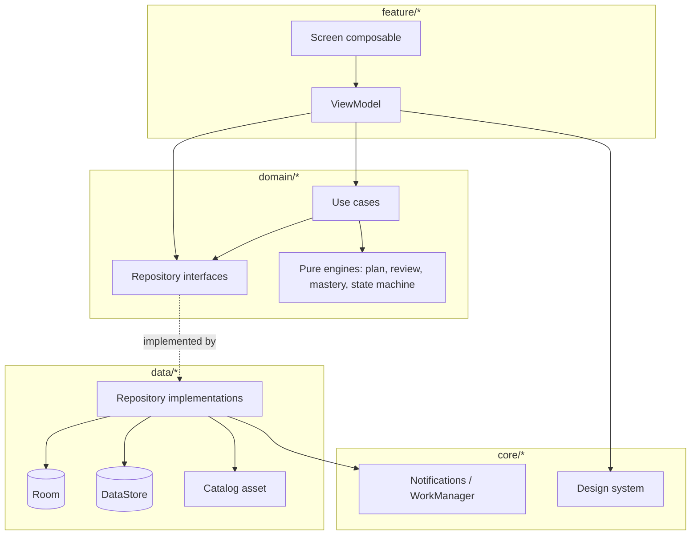

# Architecture overview

## 1. Shape

Single-activity, single-Gradle-module Compose app with three layers and a strict one-way dependency rule.



**Dependency rule**: `feature -> domain <- data`. `domain` imports nothing from `feature`, `data` or `android.*`. `feature` never imports `data`. Violations are caught by the package-boundary test in `docs/testing/00-strategy.md`.

## 2. Why a single module

One Gradle module with enforced package boundaries (ADR-0001). The MVP has one team, one binary and no dynamic delivery; multi-module build overhead would buy nothing today. The package structure is already the module structure, so splitting later is a mechanical move. The documented trigger for splitting is in `01-package-structure.md` section 5.

## 3. Unidirectional state

Every screen is:

```
UiState (immutable data class)  ->  Composable  ->  UiEvent (sealed)  ->  ViewModel  ->  UiState
```

- One `StateFlow<XUiState>` per screen. No multiple flows for one screen.
- `UiState` is a `data class` with an explicit `loading` / `content` / `error` representation, not a sealed hierarchy - screens show partial content while refreshing (`docs/ux/03-ux-states.md`).
- Events are a sealed interface handled by a single `onEvent(event: XUiEvent)`.
- One-shot effects (navigation, snackbars, haptics) go through a separate `Channel<XEffect>` consumed as a `Flow` in a `LaunchedEffect`. Never model navigation as state.

Details and the template in `02-state-management.md`.

## 4. Dependency injection

Hilt. Components used: `SingletonComponent` (database, DataStore, repositories, catalog, scheduler, clock), `ViewModelComponent` (use cases where scoping helps - mostly unscoped `@Inject constructor`), `ActivityRetainedComponent` (nothing today).

Modules live in `di/`:

| Module | Provides |
| --- | --- |
| `DatabaseModule` | `IteraDatabase`, every DAO |
| `DataStoreModule` | preferences `DataStore<Preferences>`, focus-timer `DataStore<FocusTimerState>` |
| `RepositoryModule` | `@Binds` for every repository interface |
| `CatalogModule` | `TechniqueCatalogRepository` backed by the bundled asset |
| `DispatcherModule` | `@IoDispatcher`, `@DefaultDispatcher`, `@MainDispatcher` qualifiers |
| `ClockModule` | `Clock` (`Clock.systemDefaultZone()` in prod, `FakeClock` in tests) |
| `WorkerModule` | `HiltWorkerFactory` wiring |
| `NotificationModule` | `NotificationManagerCompat`, channel setup, `ReminderScheduler` |
| `CoachModule` | `CoachFeedbackProvider` -> `NoOpCoachFeedbackProvider` (ADR-0016) |

**No `Clock.systemUTC()` or `LocalDate.now()` anywhere outside `ClockModule`.** Every date/time read goes through the injected `Clock`. This is what makes the engines testable and the training-day logic verifiable.

## 5. Threading

- ViewModels expose `stateIn(viewModelScope, SharingStarted.WhileSubscribed(5_000), initial)`.
- Repository reads are `Flow` from Room, which already runs off the main thread.
- Repository writes are `suspend` on `@IoDispatcher`.
- Pure engine functions are called from `@DefaultDispatcher` when they touch more than a handful of rows; otherwise inline.
- No `runBlocking` in production code. No `GlobalScope`.

## 6. Error handling

Summarised here, detailed in `05-error-handling-and-logging.md`.

- Domain operations that can fail return `Result<T>` or a sealed domain error; they do not throw for expected conditions (illegal state transition, missing activity, corrupt payload).
- Unexpected exceptions propagate and crash in debug; in release they are caught at the ViewModel boundary, turned into a `UiState.error`, and logged.
- The app has **no** network layer, so there is no retry/backoff/offline story to build - every failure is local and either recoverable or a bug.

## 7. Offline-first

There is no online. No network permission is declared in the manifest. Every feature works in airplane mode by construction. Fonts, the technique catalog and all copy are bundled.

## 8. Startup

Target: Today's first frame within **500 ms** of a warm start.

1. `Application.onCreate` does the minimum: Hilt, notification channels (cheap), `WorkManager` initialisation via the on-demand initializer (not the default `Initializer`, so it does not block startup).
2. `MainActivity` installs the splash screen, holds it while `PreferencesRepository.preferences.first()` resolves the start destination.
3. The plan for today is ensured **asynchronously** by the Today view model, not before the first frame. Today renders its skeleton immediately and fills in.
4. `DailyPlanWorker` and reminder rescheduling are enqueued after the first frame, from a `LaunchedEffect` at the app root.

Nothing blocks startup on WorkManager, analytics, or plan generation (`docs/prd/04-nonfunctional-requirements.md`).

## 9. Build configuration

| Setting | Value | Note |
| --- | --- | --- |
| `namespace` / `applicationId` | `com.wivernz.itera` | already set |
| `compileSdk` / `targetSdk` | 37 | already set |
| `minSdk` | 26 | already set; covers `java.time` without desugaring on API 26+ |
| Java / Kotlin JVM target | 11 | already set. The prototype uses 17; either works, keep the scaffold's |
| Build types | `debug`, `release` | release adds R8 + resource shrinking (issue 040) |
| Compose compiler | Kotlin 2.2.10 plugin | already set |
| KSP | for Room and Hilt | to add in issue 001 |

AGP 9 provides built-in Kotlin support, so no separate `org.jetbrains.kotlin.android` plugin alias is needed; only the Compose compiler plugin is applied explicitly.

`MainActivity` extends **`AppCompatActivity`**, not `ComponentActivity`, and the app theme derives from `Theme.AppCompat.DayNight.NoActionBar`. This is required for per-app language switching below Android 13 (ADR-0017).

`design/` is not part of this build. It has its own `settings.gradle.kts` and is opened as a separate project.

## 10. Documents that refine this one

| Topic | Document |
| --- | --- |
| Package layout and boundary enforcement | `01-package-structure.md` |
| ViewModel / UiState template | `02-state-management.md` |
| Compose rules | `03-compose-conventions.md` |
| Navigation wiring | `04-navigation-architecture.md`, `docs/ux/01-navigation-graph.md` |
| Errors and logging | `05-error-handling-and-logging.md` |
| Exact dependency list and versions | `06-dependency-catalog.md` |
| Individual decisions | `adr/` |
