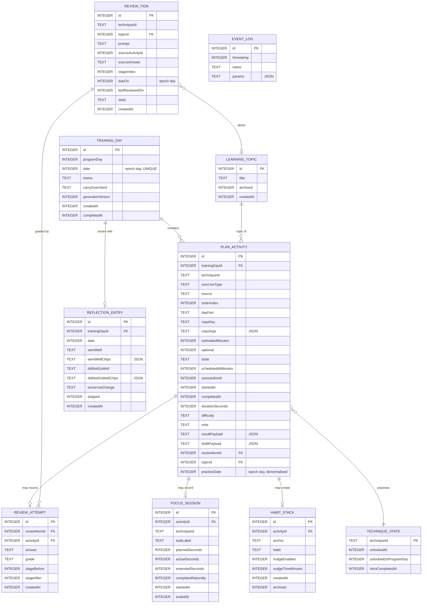

# Room schema

Database: `itera.db`. Version **1** at first release. Schema export is on (`room.schemaLocation = app/schemas`) and the exported JSON is committed.

All timestamps are `INTEGER` epoch milliseconds (UTC). All dates are `INTEGER` epoch days (`LocalDate.toEpochDay()`). All local times are `INTEGER` minutes since midnight. Converters live in `data/database/Converters.kt`.

## 1. Entity relationship diagram



## 2. Tables

### `training_day`

| Column | Type | Notes |
| --- | --- | --- |
| `id` | INTEGER PK autoincrement | |
| `programDay` | INTEGER NOT NULL | 1-based; advances only on completion (R-06) |
| `date` | INTEGER NOT NULL | epoch day, **UNIQUE** - one plan per calendar day |
| `status` | TEXT NOT NULL | `PLANNED` / `IN_PROGRESS` / `COMPLETE` / `ABANDONED` |
| `carryOverIntent` | TEXT NULL | previous day's "change for tomorrow" |
| `generatorVersion` | INTEGER NOT NULL | bumped when the plan generator changes, so old days are never regenerated |
| `createdAt` | INTEGER NOT NULL | |
| `completedAt` | INTEGER NULL | |

Indices: `UNIQUE(date)`, `INDEX(programDay)`.

### `plan_activity`

| Column | Type | Notes |
| --- | --- | --- |
| `id` | INTEGER PK autoincrement | |
| `trainingDayId` | INTEGER NOT NULL | FK -> `training_day.id`, `ON DELETE CASCADE` |
| `techniqueId` | TEXT NOT NULL | catalog id, not a FK (catalog is an asset) |
| `exerciseType` | TEXT NOT NULL | |
| `source` | TEXT NOT NULL | |
| `orderIndex` | INTEGER NOT NULL | position in the day's checklist |
| `dayPart` | TEXT NOT NULL | |
| `copyKey` | TEXT NOT NULL | string-resource key for title/subtitle/instruction (localisation, section 5) |
| `copyArgs` | TEXT NOT NULL | JSON object of format arguments |
| `estimatedMinutes` | INTEGER NOT NULL | |
| `optional` | INTEGER NOT NULL | 0/1 |
| `state` | TEXT NOT NULL | |
| `scheduledAtMinutes` | INTEGER NULL | minutes since midnight |
| `snoozedUntil` | INTEGER NULL | |
| `startedAt` | INTEGER NULL | |
| `completedAt` | INTEGER NULL | |
| `durationSeconds` | INTEGER NULL | |
| `difficulty` | TEXT NULL | `EASY` / `OKAY` / `HARD` |
| `note` | TEXT NULL | |
| `resultPayload` | TEXT NULL | JSON, discriminated union (ADR-0006) |
| `draftPayload` | TEXT NULL | JSON, cleared on completion |
| `reviewItemId` | INTEGER NULL | FK -> `review_item.id`, `ON DELETE SET NULL` |
| `topicId` | INTEGER NULL | FK -> `learning_topic.id`, `ON DELETE SET NULL` |
| `practiceDate` | INTEGER NOT NULL | epoch day, copied from the parent day - denormalised so mastery queries need no join |

Indices: `INDEX(trainingDayId)`, `INDEX(techniqueId, practiceDate)`, `INDEX(state)`, `INDEX(reviewItemId)`.

`plan_activity` is the **single activity log**. Manual practices from Technique detail and "Keep using" taps are rows here with `source = MANUAL` / `PRACTICE_PROMPT`, attached to the current training day. There is no separate practice-log table; progress is derived from this one (ADR-0013).

### `focus_session`

One row per completed or abandoned focus block. Kept separate from `plan_activity` because Progress reports focus **minutes**, and the History screen lists sessions individually.

FK `activityId` -> `plan_activity.id`, `ON DELETE CASCADE`. Index on `(startedAt)`.

### `reflection_entry`

FK `trainingDayId` -> `training_day.id`, `ON DELETE CASCADE`, **UNIQUE**. `skipped = 1` records "Skip tonight" so History can show it honestly. Index on `(date)`.

### `review_item`

FK `topicId` -> `learning_topic.id`, `ON DELETE CASCADE`. Indices: `INDEX(dueOn, state)`, `INDEX(techniqueId)`.

### `review_attempt`

Append-only. FK `reviewItemId` -> `review_item.id` `ON DELETE CASCADE`; FK `activityId` -> `plan_activity.id` `ON DELETE CASCADE`. `stageBefore` / `stageAfter` make the ladder auditable in tests.

### `learning_topic`

Seeded empty. A topic is created either from the You tab's topic editor or inline on the Feynman screen ("Change topic"). Index on `(archived, createdAt)`.

### `technique_state`

| Column | Type | Notes |
| --- | --- | --- |
| `techniqueId` | TEXT PK | |
| `unlockedAt` | INTEGER NULL | null = locked |
| `unlockedOnProgramDay` | INTEGER NULL | |
| `introCompletedAt` | INTEGER NULL | drives `MasteryLevel.MET` |

Only unlock facts are stored. Mastery level itself is derived (ADR-0013).

### `habit_stack`

The saved "After I X, I will Y" stack. `nudgeEnabled` + `nudgeTimeMinutes` feed the WorkManager nudge. FK `activityId` -> `plan_activity.id`, `ON DELETE SET NULL`.

### `event_log`

Local analytics sink (`docs/analytics/00-event-model.md`). Ring-buffered: a `WorkManager` job trims to the newest 2 000 rows weekly. Never leaves the device in the MVP.

## 3. DAOs

One DAO per aggregate, in `data/database/dao`. DAOs return **entities**, never domain types (ADR-0004).

| DAO | Key queries |
| --- | --- |
| `TrainingDayDao` | `observeByDate`, `observeWithActivities(id)`, `findByDate`, `insert`, `updateStatus`, `latestCompleted` |
| `PlanActivityDao` | `observeForDay`, `byId`, `updateState`, `updateDraft`, `complete`, `insertAll`, `countDistinctPracticeDays(techniqueId)`, `usesSince(techniqueId, epochDay)`, `firstUse(techniqueId)`, `usedInCombination(techniqueId)` |
| `FocusSessionDao` | `insert`, `observeBetween`, `totalSecondsSince(epochDay)` |
| `ReflectionDao` | `upsert`, `observeForDay`, `latestIntent()` |
| `ReviewItemDao` | `observeDue(epochDay)`, `observeUpcoming`, `byId`, `insert`, `updateStage` |
| `ReviewAttemptDao` | `insert`, `observeForItem` |
| `LearningTopicDao` | `observeActive`, `insert`, `rename`, `archive`, `leastRecentlyReviewed()` |
| `TechniqueStateDao` | `observeAll`, `unlock`, `markIntroComplete`, `byId` |
| `HabitStackDao` | `observeActive`, `insert`, `archive` |
| `EventLogDao` | `insert`, `trimTo(limit)`, `exportSince(timestamp)` |

`@Transaction` + a `@Relation`-bearing `TrainingDayWithActivities` POJO powers `observeWithActivities`.

## 4. Result payload encoding (ADR-0006)

`resultPayload` and `draftPayload` hold a JSON object with a `type` discriminator matching the `ActivityResult` subclass:

```json
{ "type": "focus", "taskLabel": "Outline the Q4 roadmap", "plannedSeconds": 1500,
  "actualSeconds": 1500, "extendedSeconds": 300, "completedNaturally": true }
```

`kotlinx.serialization` with a `SerializersModule` registering every `ActivityResult` subclass under a stable `@SerialName`. Serial names are **frozen** once released; renaming one is a breaking change requiring a migration (`05-migrations-and-content-versioning.md`).

Unknown keys are ignored on read (`ignoreUnknownKeys = true`) so a forward-rolled payload never crashes an older build. A payload whose `type` does not deserialise is surfaced as `result = null` and logged, never thrown - the History row degrades to its title only.

## 5. Copy keys, not copy (localisation)

`plan_activity` stores `copyKey` + `copyArgs`, never rendered English. Example:

```
copyKey  = "activity_program_new_technique"
copyArgs = {"technique":"two_minute_rule","minutes":5}
```

The repository resolves these through an injected `CopyResolver` (backed by `Context.getString` + the catalog) when mapping to `PlanActivity`. Consequences: switching device language re-renders past history correctly, and no user-facing English ever lands in the database. Free text the user typed (`note`, result payload strings) is stored verbatim and never translated.

## 6. Migrations

Version 1 is the first shipped schema. Policy:

- Every schema change ships a hand-written `Migration` plus a `MigrationTest` against the exported JSON. `fallbackToDestructiveMigration` is **forbidden** in release builds; debug builds may use `fallbackToDestructiveMigrationOnDowngrade` only.
- Adding a nullable column or a new table is additive and needs no data rewrite.
- Renaming or retyping a column requires create-copy-drop-rename inside one transaction.

## 7. Database configuration

```kotlin
Room.databaseBuilder(context, IteraDatabase::class.java, "itera.db")
    .addCallback(SeedCallback(...))        // seeds technique_state for the catalog
    .setJournalMode(JournalMode.WRITE_AHEAD_LOGGING)
    .build()
```

- `allowMainThreadQueries` is never enabled.
- Foreign keys are on (Room enables them by default).
- The seed callback writes one `technique_state` row per catalog technique with `unlockedAt = null`, then unlocks the Day-1 technique and Daily reflection.

## 8. Backup

`android:allowBackup="true"` stays, but `data_extraction_rules.xml` **excludes** `itera.db` and the DataStore file from cloud backup and includes them in device-to-device transfer. Reason: restoring a half-stale program onto a device that has since trained would corrupt `programDay`. Device transfer is a full-state move and is safe.
