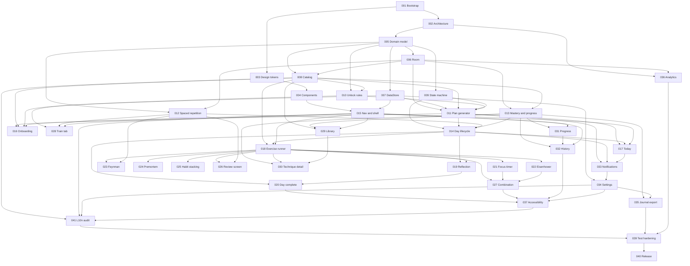

# Issue dependency graph

An edge `A --> B` means **B depends on A**; B cannot start until A is merged.

## 1. Graph

## 2. Dependency table

| Issue | Depends on | Blocks |
| --- | --- | --- |
| 001 Bootstrap | - | 002, 003 |
| 002 Architecture | 001 | 005, 036 |
| 003 Design tokens | 001 | 004 |
| 004 Components | 003 | 015 |
| 005 Domain model | 002 | 006, 007, 008, 009, 010, 012 |
| 006 Room | 005 | 008, 011, 012, 013, 036 |
| 007 DataStore | 005 | 011, 015, 016, 034 |
| 008 Catalog | 005, 006 | 010, 011, 013, 016, 018, 029 |
| 009 State machine | 005 | 011, 014 |
| 010 Unlock rules | 005, 008 | 011, 028 |
| 011 Plan generator | 006, 007, 008, 009, 010 | 014, 016, 017, 033 |
| 012 Spaced repetition | 005, 006 | 014, 023, 026, 028 |
| 013 Mastery and progress | 006, 008 | 014, 029, 030, 031, 032, 035 |
| 014 Day lifecycle | 009, 011, 012, 013 | 017, 018, 019, 020, 033 |
| 015 Nav and shell | 004, 007 | 016, 017, 018, 028, 029, 031, 032 |
| 016 Onboarding | 007, 008, 011, 015 | - |
| 017 Today | 011, 014, 015 | 033 |
| 018 Exercise runner | 008, 014, 015 | 019, 021-027, 030 |
| 019 Reflection | 014, 018 | 020 |
| 020 Day complete | 014, 019 | 037 |
| 021 Focus timer | 018 | 027 |
| 022 Eisenhower | 018 | 027 |
| 023 Feynman | 012, 018 | - |
| 024 Premortem | 018 | - |
| 025 Habit stacking | 018 | - |
| 026 Review screen | 012, 018 | - |
| 027 Combination | 018, 021, 022 | 037 |
| 028 Train tab | 010, 012, 015 | - |
| 029 Library | 008, 013, 015 | 030 |
| 030 Technique detail | 013, 018, 029 | - |
| 031 Progress | 013, 015 | 032 |
| 032 History | 013, 015, 031 | 037 |
| 033 Notifications | 011, 014, 017 | 034 |
| 034 Settings | 007, 033 | 035, 037 |
| 035 Journal export | 013, 034 | 039 |
| 036 Analytics | 002, 006 | 039 |
| 037 Accessibility | 020, 027, 032, 034 | 041 |
| 041 L10n verification and audit | 037 | 039 |
| 039 Test hardening | 035, 036, 041 | 040 |
| 040 Release | 039 | - |

## 3. Critical path

`001 -> 002 -> 005 -> 006 -> 008 -> 011 -> 014 -> 018 -> 021 -> 027 -> 037 -> 041 -> 039 -> 040`

Fourteen issues. Everything else can be scheduled around it. Delays on this path delay the MVP; delays elsewhere do not.

## 4. Issues with no dependents

016, 023, 024, 025, 026, 028, 030 - these can slip to the end of their phase without blocking anything else. They are the safest places to absorb schedule pressure, though all are MVP scope.

## 4a. Localisation is not a node

Localisation has no single implementing issue. It is distributed across `001` (platform setup), `002` (primitives), `003` (fonts), `004` (picker), `008` (content), `016` and `034` (entry points), and every screen issue (its own strings). `041` only audits the result, which is why its single dependency is `037` - it must run after the last thing that can move a layout (D-15).

## 5. Cycle check

The graph is acyclic. `014` depends on `013`, and `013` depends only on `006` and `008`; the progress calculation deliberately does not depend on the day lifecycle (it reads the activity log directly, per ADR-0013), which is what keeps this edge one-way.
