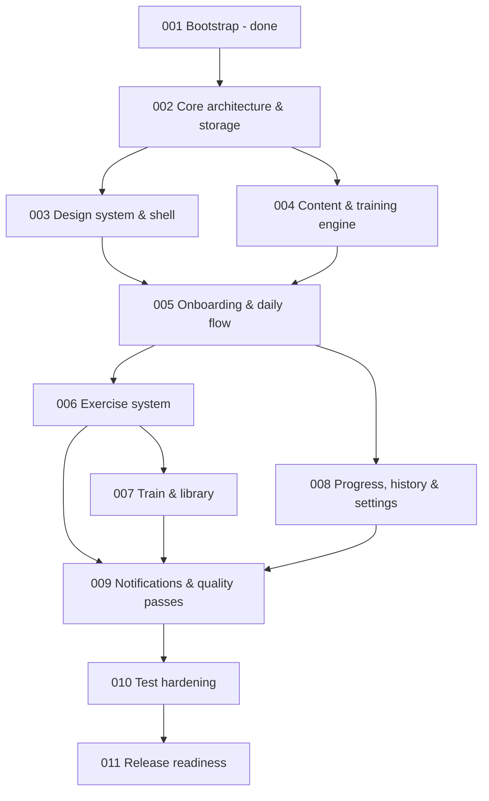

# Issue dependency graph

An edge `A --> B` means **B depends on A**. The previous 40-node graph is preserved in `docs/history/issues-detailed/` via the old issues' `Depends on` lines.

## Critical path

`001 -> 002 -> 004 -> 005 -> 006 -> 007 -> 009 -> 010 -> 011`

003 is off the path only if done alongside 004; 008 is off the path if done alongside 006-007.

## Cross-milestone seams

Three dependencies from the detailed backlog would otherwise point backwards after consolidation; each is resolved by a seam rather than by reordering:

| Detailed dependency | Resolution |
| --- | --- |
| Old 014 (engine, now 004) appends an analytics event; old 036 (analytics) was late | Analytics interface, catalogue and sink move into 002 |
| Old 034 (settings, now 008), 016, 020, 025 call `ReminderScheduler` from old 033 (now 009) | `ReminderScheduler` interface + no-op binding in 004; 009 binds the real one |
| Old 021 (timer, now 006) needs the `focus_session` channel created by old 033 (now 009) | 006 creates that channel; 009 adds the others to the same registry |

Two soft forward links remain and are verified by the later milestone: Train's past-day nodes open History (007 -> 008), and settings toggles driving real reminders (008 -> 009).

The graph is acyclic.
