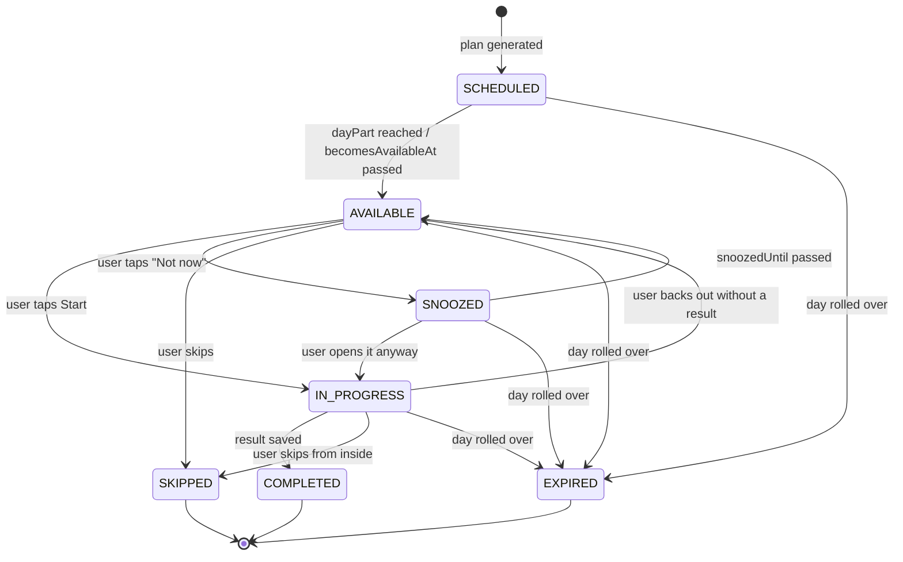

# Exercise state machine

Applies to every `PlanActivity` regardless of `ExerciseType`. Implemented as a pure function in `domain/training/ActivityStateMachine.kt`; no Android dependencies, fully unit-tested.

## 1. States

Seven domain states map onto the prototype's three visual `StepState`s (`Next`, `Now`, `Done`).

| State | Meaning | `StepState` | User sees |
| --- | --- | --- | --- |
| `SCHEDULED` | In the plan, not yet reachable (a later day part) | `Next` | 2 dp `line` ring, subtitle shows the time |
| `AVAILABLE` | Reachable now | `Now` | 2 dp skill ring with a pulsing dot; the hero card offers it |
| `IN_PROGRESS` | Opened and started | `Now` | Same as available; resuming re-enters the body with the draft |
| `SNOOZED` | "Not now - remind me at 12:00" | `Next` | Row dims, subtitle becomes "Snoozed until 12:00" |
| `COMPLETED` | Finished with a result | `Done` | Filled skill disc with a check, title struck through, subtitle echoes the note |
| `SKIPPED` | Deliberately passed over ("Skip tonight") | `Done` | Filled `line`-coloured disc, subtitle "Skipped" |
| `EXPIRED` | The day rolled over before completion | - | Not shown on Today; appears in History as not done |

Visual spec for `StepRow` and `StepDot`: `docs/ux/04-design-system.md` section 4.

## 2. Transition diagram



## 3. Transition table

`ActivityStateMachine.transition(current, event, now): Result<ActivityState>`

| From | Event | To | Guard | Side effect |
| --- | --- | --- | --- | --- |
| `SCHEDULED` | `Reach` | `AVAILABLE` | `now >= becomesAvailableAt` | none |
| `SCHEDULED` | `DayRollover` | `EXPIRED` | - | none |
| `AVAILABLE` | `Start` | `IN_PROGRESS` | - | set `startedAt = now`; day status -> `IN_PROGRESS` |
| `AVAILABLE` | `Snooze(until)` | `SNOOZED` | `until > now` and `until` is before end of day | set `snoozedUntil`; schedule a one-shot reminder |
| `AVAILABLE` | `Skip` | `SKIPPED` | `optional == true` **or** the activity is the reflection | none |
| `AVAILABLE` | `DayRollover` | `EXPIRED` | - | cancel any pending reminder |
| `SNOOZED` | `Reach` | `AVAILABLE` | `now >= snoozedUntil` | clear `snoozedUntil` |
| `SNOOZED` | `Start` | `IN_PROGRESS` | - | clear `snoozedUntil`, cancel reminder |
| `SNOOZED` | `DayRollover` | `EXPIRED` | - | cancel reminder |
| `IN_PROGRESS` | `Complete(result)` | `COMPLETED` | result type matches `exerciseType` | persist result, clear draft, set `completedAt`, `durationSeconds`; fire post-completion effects (section 5) |
| `IN_PROGRESS` | `Abandon` | `AVAILABLE` | - | keep draft, clear `startedAt` |
| `IN_PROGRESS` | `Skip` | `SKIPPED` | same guard as `AVAILABLE -> SKIPPED` | clear draft |
| `IN_PROGRESS` | `DayRollover` | `EXPIRED` | - | keep draft (so History can show partial work) |

Every other `(state, event)` pair returns `Result.failure(IllegalTransition)`. The machine never throws; callers log and ignore. This makes double taps and stale notification deep links harmless.

## 4. Availability rules

`becomesAvailableAt` is computed at generation time, not stored as a state:

| `dayPart` | Available from |
| --- | --- |
| `MORNING` | start of the local day (00:00) - the morning activity is always reachable whenever the user opens the app |
| `DAYTIME` | `max(preferences.morningTime + 90 min, 11:00)` - the prototype's focus step reads "Suggested around 11:00" |
| `EVENING` | `preferences.eveningTime - 60 min` - the reflection becomes tappable an hour early so an early night still works |

A `SCHEDULED -> AVAILABLE` transition is evaluated lazily whenever Today is observed, not by a timer. The Today view model re-evaluates on every emission and on `ON_RESUME`.

Optional activities are never blocking: an `EVENING` reflection is reachable even if the `DAYTIME` focus suggestion is still `SCHEDULED`.

## 5. Post-completion effects

Fired inside the same transaction as `Complete`, by `CompleteActivityUseCase`:

1. **Technique state** - if this is the technique's first completion, set `technique_state.introCompletedAt` (-> `MasteryLevel.MET`).
2. **Review scheduling** - if `technique.reviewEligible` and the result carries a reviewable answer (Feynman explanation, Spaced-repetition item), create a `review_item` at `stageIndex = 0`, `dueOn = today + 1`.
3. **Focus session** - if `exerciseType == FOCUS_TIMER`, insert the `focus_session` row.
4. **Habit stack** - if `exerciseType == HABIT_STACK`, insert/replace the `habit_stack` row and (re)schedule its nudge.
5. **Premortem carry-over** - if the user tapped "Add to today", insert a new `MANUAL` activity into today's plan for the mitigation action.
6. **Day completion check** - if every non-optional activity is now `COMPLETED` or `SKIPPED`, set the day to `COMPLETE`, stamp `completedAt`, and **advance `programDay` by 1** (R-06). This is the only place `programDay` changes.
7. **Analytics** - append `exercise_completed` to `event_log`.

Step 6 is idempotent: re-running it on an already-`COMPLETE` day is a no-op, so a replayed WorkManager job or a double tap cannot double-advance the program.

## 6. Day rollover

Evaluated when the app is opened and by the daily plan worker:

```
if (latestDay != null && latestDay.date < today) {
    latestDay.activities
        .filter { it.state in setOf(SCHEDULED, AVAILABLE, IN_PROGRESS, SNOOZED) }
        .forEach { it.state = EXPIRED }
    latestDay.status = if (latestDay.hasAnyCompleted) COMPLETE else ABANDONED
    // programDay is NOT advanced for an abandoned day
}
```

An abandoned day leaves `programDay` untouched: the same curriculum day is regenerated tomorrow. This is the mechanical expression of "Missing a day never resets anything."

A day with **some** completions but not all is marked `COMPLETE` and **does** advance `programDay`, provided the day's `PROGRAM` activity was completed. If the program activity expired, the day is `ABANDONED` regardless of how many optional items were done.

## 7. Reachable-state tests

The unit test suite enumerates all `7 x 6 = 42` `(state, event)` pairs and asserts each is either the documented target or `IllegalTransition`. Adding a state or an event without updating that test fails the build.
