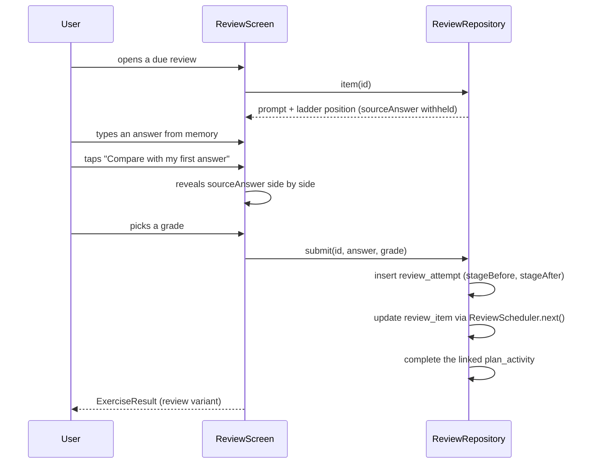

# Spaced repetition

`domain/review/ReviewScheduler.kt`. Pure function, no Android, no clock access (the date is a parameter).

## 1. The ladder

Five stages. Intervals are measured in **days from the review date**, not from creation.

| `stageIndex` | Interval to the next review | UI label |
| --- | --- | --- |
| 0 | 1 day | `1 d` |
| 1 | 4 days | `4 d` |
| 2 | 9 days | `9 d` |
| 3 | 21 days | `3 wk` |
| 4 | 60 days | `2 mo` |
| (past 4) | retired | - |

These five stages are rendered by `IntervalLadder` in `design/app/src/main/java/com/itera/app/ui/screens/Practice.kt` as `1 d / 4 d / 9 d / 3 wk / 2 mo`. The ladder is a visible UI element, so the stage count is fixed at five (R-02, confirmed by the prototype).

```kotlin
val INTERVALS_DAYS = intArrayOf(1, 4, 9, 21, 60)
```

## 2. Creation

A `review_item` is created by `CompleteActivityUseCase` when the completed technique is `reviewEligible` and the result carries a recallable answer.

In the MVP exactly two techniques are `reviewEligible`:

| Technique | Recallable content | Prompt template |
| --- | --- | --- |
| Feynman technique | the explanation text | `review_prompt_feynman`: "{n} days ago you explained {topic}." |
| Spaced repetition | the item the user chose to remember | `review_prompt_generic`: "{n} days ago you wrote this down." |

On creation: `stageIndex = 0`, `dueOn = completionDate + 1`, `state = SCHEDULED`, `sourceAnswer` = the answer, which is **hidden from the user until the attempt is submitted** - the prototype renders a locked box saying so.

Only one active review item per `(techniqueId, topicId)` pair. Re-doing a Feynman exercise on the same topic **updates** the existing item: `sourceAnswer` is replaced with the newer explanation and the stage is left unchanged.

## 3. Grading and the next interval

The user self-grades after seeing the comparison:

| Grade | Meaning shown to the user | Stage change |
| --- | --- | --- |
| `FORGOT` | "I couldn't recall it" | `stageIndex = 0` (restart) |
| `PARTIAL` | "Roughly, with gaps" | `stageIndex` unchanged (repeat the interval) |
| `SOLID` | "I had it" | `stageIndex + 1` |

```kotlin
fun next(item: ReviewItem, grade: RecallGrade, reviewedOn: LocalDate): ReviewItem {
    val nextStage = when (grade) {
        RecallGrade.FORGOT  -> 0
        RecallGrade.PARTIAL -> item.stageIndex
        RecallGrade.SOLID   -> item.stageIndex + 1
    }
    return if (nextStage > INTERVALS_DAYS.lastIndex) {
        item.copy(state = ReviewState.RETIRED, lastReviewedOn = reviewedOn)
    } else {
        item.copy(
            stageIndex = nextStage,
            dueOn = reviewedOn.plusDays(INTERVALS_DAYS[nextStage].toLong()),
            lastReviewedOn = reviewedOn,
            state = ReviewState.SCHEDULED
        )
    }
}
```

The caption "If this goes well, the next review is in {n} days" is rendered from `INTERVALS_DAYS[stageIndex + 1]` before grading - it previews the `SOLID` outcome. It is a plural (`review_next`).

A retired item stays in the database and is shown on Technique detail as part of the practice history, but never becomes due again.

## 4. Becoming due

Reviews do **not** decay while the user is away. `dueOn` is an absolute date; an item due 30 days ago is simply due, with no penalty and no pile-up multiplier. Overdue items sort first.

```kotlin
fun dueOn(items: List<ReviewItem>, date: LocalDate): List<ReviewItem> =
    items.filter { it.state != ReviewState.RETIRED && it.dueOn <= date }
         .sortedWith(compareBy({ it.dueOn }, { -it.stageIndex }, { it.id }))
```

The plan engine surfaces at most `reviewCap(pace)` of these on Today (`01-training-plan-engine.md` section 3.1); the Train tab shows the whole queue.

## 5. Unlock coupling

The **Spaced repetition** technique itself unlocks on Day 10. Reviews created before Day 10 (from Feynman on Day 6) still appear - the user meets reviews before they meet the technique that names them, which the prototype also does (its Train tab surfaces a review from program day 7). The Day-10 intro exercise then explains the mechanism the user has already been using. This is intentional and must not be "fixed" by gating reviews behind Day 10.

## 6. Interaction with the review screen



`sourceAnswer` must not be sent to the composable before submission - the view model holds it in a private field and only copies it into `UiState` on reveal. A UI test asserts the text is absent from the semantics tree before the compare tap.

## 7. Post-MVP adaptivity

The fixed ladder is deliberate. The seam for a future adaptive scheduler is `ReviewScheduler`, which is already a single pure function with `(item, grade, date) -> item`. An SM-2-style scheduler would add `easeFactor` and `intervalDays` columns to `review_item` (additive migration) and replace the body of `next()`. The five drawn ladder nodes would then represent *stage count*, not fixed intervals, which is a visual change requiring design input - hence not in the MVP.

## 8. Tests

`ReviewSchedulerTest`:

- each grade from each of the 5 stages -> exact expected `(stageIndex, dueOn, state)`;
- `SOLID` at stage 4 retires the item;
- `FORGOT` at any stage returns to `dueOn = reviewedOn + 1`;
- due-selection ordering with mixed overdue/today items;
- an item 90 days overdue is due exactly once, not 90 times;
- idempotence: submitting the same attempt twice (replayed tap) produces one `review_attempt` row, guarded by the linked activity already being `COMPLETED`.
