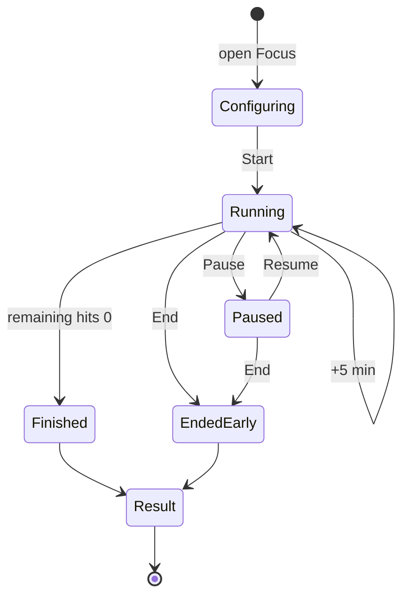

# Focus timer lifecycle

The focus timer is the only long-running foreground task in the app. It must survive backgrounding, screen-off, process death and device rotation, and must never drift.

## 1. Principle: store an end instant, not a countdown

The source of truth is a **wall-clock end timestamp**, never a decrementing counter (ADR-0009). Remaining time is always `endsAt - now`. A `CoroutineScope` tick at 1 Hz exists only to re-render; if it is starved, the next tick shows the correct value.

```kotlin
data class FocusTimerState(
    val activityId: Long,
    val techniqueId: TechniqueId,
    val taskLabel: String,
    val plannedSeconds: Int,
    val extendedSeconds: Int,
    val startedAt: Instant,
    val endsAt: Instant,
    val pausedAt: Instant?,      // null while running
    val accumulatedPauseMs: Long
)

val remaining: Duration get() = (endsAt - (pausedAt ?: now)).coerceAtLeast(ZERO)
```

Pausing stores `pausedAt`. Resuming shifts `endsAt` forward by the pause duration and adds it to `accumulatedPauseMs`. `+5 min` adds 300 s to both `endsAt` and `extendedSeconds`.

## 2. Persistence

`FocusTimerState` is serialised to a dedicated DataStore file `focus_timer.pb` on every state change (start, pause, resume, extend, end). It is **not** in Room: it is transient session state, not history, and it must be readable before the database opens.

On app start, `FocusTimerRepository.restore()` reads it:

| Stored state | Action |
| --- | --- |
| absent | nothing |
| present, `remaining > 0`, running | re-attach the UI, restart the foreground service |
| present, `remaining > 0`, paused | re-attach the UI in the paused state |
| present, `remaining <= 0` | auto-complete: write the `focus_session` row, complete the activity, clear the state, and route to the focus result screen on next open |
| present, `startedAt` older than 24 h | discard with a logged warning; do not write a session |

## 3. Foreground service

A running timer holds a foreground service so the countdown survives Doze and aggressive OEM process management.

- Type: `FOREGROUND_SERVICE_TYPE_SPECIAL_USE` with `android:foregroundServiceType="specialUse"` and a `PROPERTY_SPECIAL_USE_FGS_SUBTYPE` value of `focus_timer`. (`mediaPlayback` and `shortService` are wrong; `shortService` caps at 3 minutes.)
- Started on `start`/`resume`, stopped on `pause`/`end`/`complete`.
- Notification: ongoing, non-dismissable, low importance, no sound. Shows `mm:ss` remaining via `setUsesChronometer(true)` + `setChronometerCountDown(true)` so the system renders the countdown without per-second updates. Actions: **Pause/Resume** and **End**.
- Tapping the notification deep-links to `FocusSession(activityId)`.
- On Android 13+ the POST_NOTIFICATIONS permission is requested before the first timer; if denied, the timer still runs but without a notification, and a one-time inline note explains that the timer may be killed in the background.

## 4. "Notifications silenced"

The prototype's timer header carries a `focus_silenced` string. The app cannot silence other apps' notifications. Implemented honestly as: **Itera's own** reminder notifications (morning, focus suggestion, review, habit nudge) are suppressed for the duration of a running session; the evening reflection is deferred rather than dropped if it falls inside a session.

The header copy is therefore `focus_timer_own_notifications_paused`: "Itera notifications paused". Do not ship a claim the app cannot honour. If Do Not Disturb access is ever added, that is a post-MVP item with its own permission flow.

## 5. Completion



- **Finished naturally**: `completedNaturally = true`, `actualSeconds = plannedSeconds + extendedSeconds`. A short completion chime (respecting ringer mode) and a single haptic pulse. The break hint from the artboard - "Break after this one: 5 minutes, away from the screen" - is shown on the result.
- **Ended early**: a confirm dialog ("End session?" / "Keep going" / "End"). `completedNaturally = false`, `actualSeconds = elapsed - pauses`. A session shorter than **60 seconds** writes no `focus_session` row and does not complete the activity - it is treated as a mis-tap and returns to Today.
- Either way, a `focus_session` row is written and the linked `plan_activity` completes with `ActivityResult.Focus`.

## 6. Screen behaviour

- `FLAG_KEEP_SCREEN_ON` while running, cleared on pause/end. The design intends the phone to be face down, so this is a convenience for a propped device, not a requirement.
- The ring is a `Canvas` arc; its sweep is `1 - remaining / total`, recomposed once per second. `total = plannedSeconds + extendedSeconds`.
- The readout has `role = Role.Timer` semantics with `liveRegion = LiveRegionMode.Polite` announced only at 5:00, 1:00 and 0:00, never every second (`07-accessibility.md`).
- Rotation: state comes from the repository, not `rememberSaveable`, so rotation is free.

## 7. Clock changes and DST

`endsAt` is an `Instant` (epoch millis), so a timezone change or DST shift does not move it. A **manual clock change** can: if `now` jumps backwards by more than 60 s, the timer is left running against the original `endsAt` (it will simply appear longer); if it jumps forward past `endsAt`, the timer completes with `completedNaturally = true` and `actualSeconds` clamped to `plannedSeconds + extendedSeconds`. Both cases are logged.

## 8. Tests

Unit (`FocusTimerStateTest`, with a `FakeClock`):

- remaining is exact at start, mid, and 0;
- pause/resume shifts `endsAt` by exactly the pause duration;
- `+5 min` is additive and repeatable;
- restore at every branch of the table in section 2;
- a 30-second early end writes no session;
- a backward clock jump does not complete the timer.

Instrumented (`FocusTimerServiceTest`):

- the service starts on start and stops on end;
- process death mid-session restores the correct remaining time (kill via `am kill`, relaunch, assert within 2 s tolerance);
- the notification deep link lands on the session screen.
