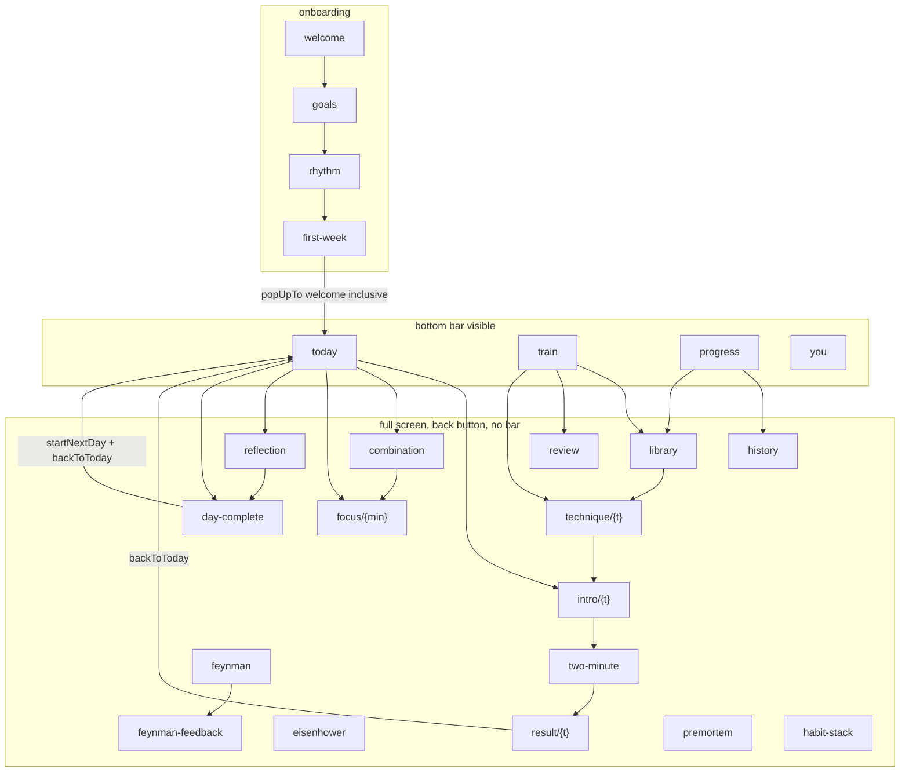

# Navigation

**Source: `design/app/src/main/java/com/itera/app/ui/IteraApp.kt`.** Route set, bar visibility, tab semantics and back behaviour are the prototype's. The only production change is the route *representation* (ADR-0008, D-02).

## 1. Shape

One `NavHost`, one `NavHostController`, flat route list. The bottom bar is shown only when the current route is one of the four tab routes:

```kotlin
val showBar = tabs.any { it.route == currentRoute }
```

There is no nested graph per tab and no second controller. Full-screen routes are siblings of the tab routes, and the bar disappears because the route is simply not a tab route.



## 2. Routes

From `Routes` in the prototype. Production declares the same set as `@Serializable` classes.

| Route | Arguments |
| --- | --- |
| `welcome`, `goals`, `rhythm`, `first-week` | - |
| `today`, `train`, `progress`, `you` | - |
| `library`, `history` | - |
| `technique/{technique}` | technique id |
| `intro/{technique}`, `result/{technique}` | technique id |
| `focus/{minutes}?technique={technique}` | minutes (Int), optional technique |
| `two-minute`, `eisenhower`, `feynman`, `feynman-feedback`, `review`, `premortem`, `habit-stack`, `combination` | - |
| `reflection`, `day-complete` | - |

In production, `{technique}` is a stable catalogue id and the exercise routes carry the `activityId` of the plan row being run, because a technique can be practised more than once a day.

## 3. Which body runs which technique

`Routes.practice(technique)` maps `ExerciseKind` to a route. Reproduce this mapping:

| `ExerciseKind` | Route |
| --- | --- |
| `TwoMinute` | `two-minute` |
| `Focus` | `focus/50` for Deep Work, `focus/25` otherwise |
| `Eisenhower` | `eisenhower` |
| `Feynman` | `feynman` |
| `Premortem` | `premortem` |
| `HabitStack` | `habit-stack` |
| `Pareto` | `combination` |
| `Review` | `review` |
| `Reflection` | `reflection` |
| `Generic` | straight to `result/{technique}` |

`Generic` covers the 5-second rule, Two-list strategy, Information diet and 1% improvement: the intro's primary button reads "I did it" with a check icon instead of "Start exercise" with a play icon, and completing it goes directly to the result screen (Q-04).

## 4. Bottom navigation

Four tabs, fixed order: **Today, Train, Progress, You**.

```kotlin
fun NavController.switchTab(route: String) {
    navigate(route) {
        popUpTo(Routes.TODAY) { saveState = true }
        launchSingleTop = true
        restoreState = true
    }
}
```

Today is the anchor: switching tabs pops back to it while saving state, so the back stack never grows by tab switching and system back from any tab lands on Today, then exits.

Re-tapping the active tab is a no-op (`launchSingleTop`).

Visual spec in `04-design-system.md` section 5.

## 5. Returning to Today

```kotlin
fun NavController.backToToday() {
    navigate(Routes.TODAY) {
        popUpTo(Routes.TODAY) { inclusive = true }
        launchSingleTop = true
    }
}
```

Used by the exercise result ("Done") and by day complete ("Good night", after `startNextDay()`). It clears the whole flow above Today, so back from Today after finishing an exercise does not re-enter it.

Reflection navigates to day complete with `popUpTo(Routes.TODAY)`, so the reflection screen is not left on the stack behind it.

## 6. Onboarding exit

Both "Start Day 1" and "Explore with demo data" navigate to `today` with `popUpTo(welcome) { inclusive = true }`. Onboarding is unreachable afterwards except through "Erase everything".

The start destination is decided once, from persisted state:

```kotlin
val start = rememberSaveable { if (onboarded) Routes.TODAY else Routes.WELCOME }
```

In production the flag comes from DataStore and the `NavHost` is not composed until it resolves, so there is no flicker.

## 7. Back behaviour

| Screen | Back |
| --- | --- |
| Onboarding steps | `popBackStack()`, values preserved |
| Tabs | pops to Today, then exits |
| Library, History, Technique detail | `popBackStack()` to the caller |
| Exercise intro | `popBackStack()`; the activity stays available, this is not a skip |
| Exercise bodies | `popBackStack()` to intro. Production adds a confirmation when a draft is non-empty |
| Exercise result | `backToToday()` - back does what "Done" does |
| Focus | production confirms "End session?"; the prototype ends immediately |
| Reflection | `onClose` = "Skip tonight" |
| Day complete | same as "Good night" |

## 8. Production additions

| Addition | Why |
| --- | --- |
| Type-safe `@Serializable` routes | Compile-checked arguments; identical behaviour (ADR-0008) |
| `activityId` on exercise routes | A technique can be run more than once a day |
| Deep links from notifications | `itera.deeplink` intent extra read in `onNewIntent`, navigated once after the host composes, then cleared. Synthetic stack always ends at Today |
| Draft confirmation on back | Exercise bodies with unsaved text |
| `testTag` per route root | Navigation UI tests |
| Start destination gated on DataStore | The prototype reads an in-memory flag |

## 9. Deep-link targets

| Notification | Target | Stale fallback |
| --- | --- | --- |
| Morning training | `intro/{today's technique}` | `today` |
| Focus suggestion | `today` | - |
| Review due | `review` | `train` |
| Evening reflection | `reflection` | `today` |
| Habit nudge | `today` | - |

A deep link to an already-completed activity opens its result read-only.
